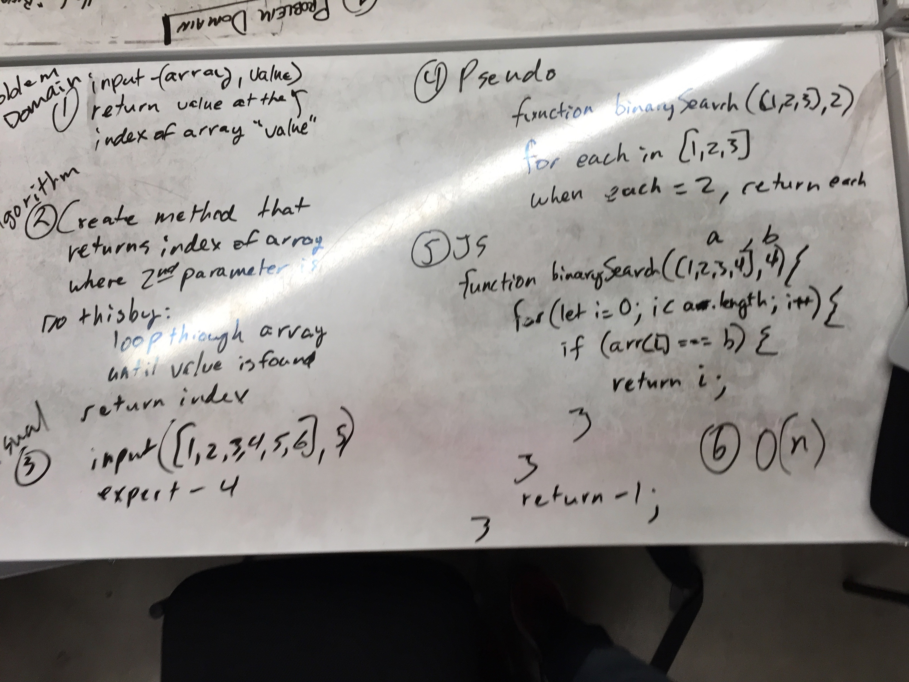

# Binary search 

## Problem
With inputs of a sorted array and a value, `binarySearch(arr, val)` conducts a binary search of the array and returns the index of where that value is in the array. If it is not in the array, it returns -1. 

## Solution
