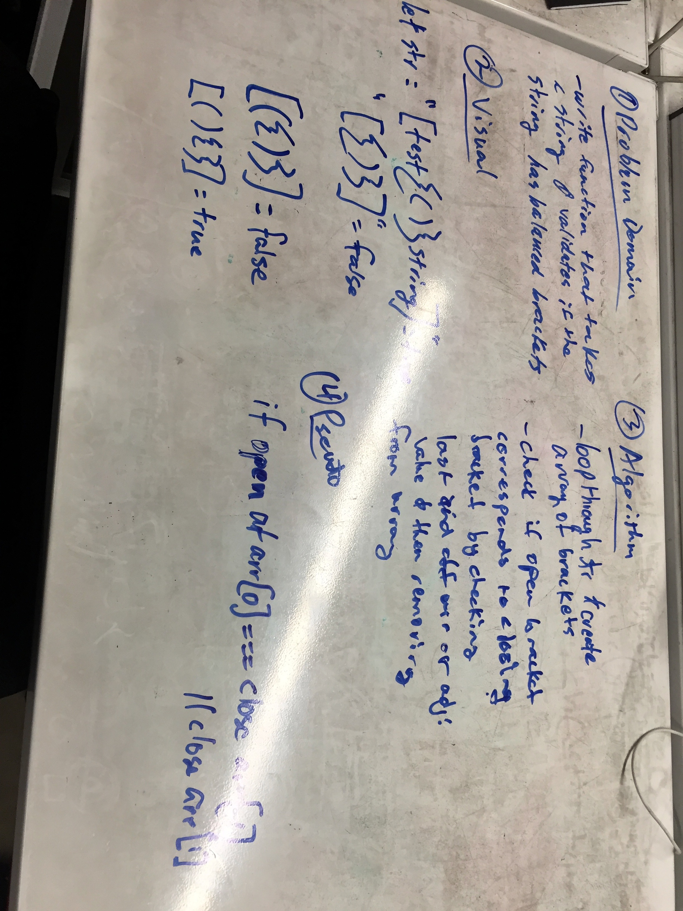

# Validating Order of Brackets in a string

## Problem
With an input of a string, return true if each opening bracket has a corresponding closing bracket and no brackets are out of order.

A stack is easily used to solve this problem by iterating through the string, pushing opening brackets to the stack, and validating the top of the stack whenever a closing bracket is encountered in the string iteration. If at the end of the iteration the stack is empty, all brackets in the string are validated.

## Solution
