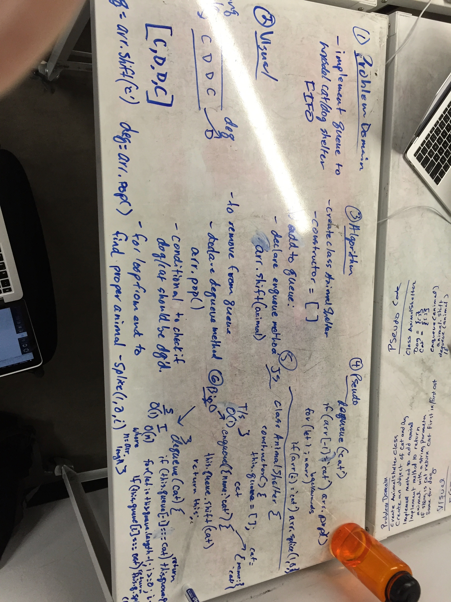

# FIFO - Animal Shelter

## Challenge
Model an animal shelter as a queue (first-in, first-out). Dogs and cats enter the queue and are dequeued as normal ina queue. However, if dequeue calls an animal that is not at the front of the queue, the animal of that type closest to the front is dequeued.

## Solution

