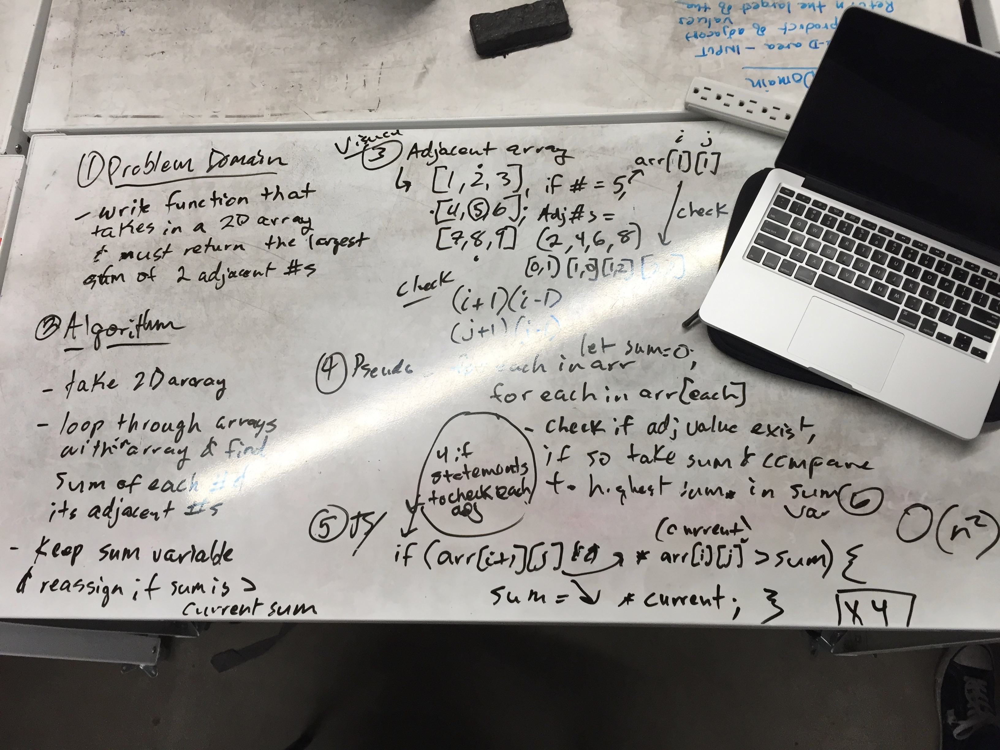

# Largest product of Two adjacent values in a 2D array

## Problem
Given a two-dimensional array, calculate the largest possible sum of two adjacent numbers in the array. Adjacent values can be found given arr[i][j] as:
  - arr[i + 1][j]
  - arr[i][j + 1]
  - arr[i - 1][j]
  - arr[i][j - 1]
The latter two do not need to be checked as they will have already been checked by the first two.

## Solution
