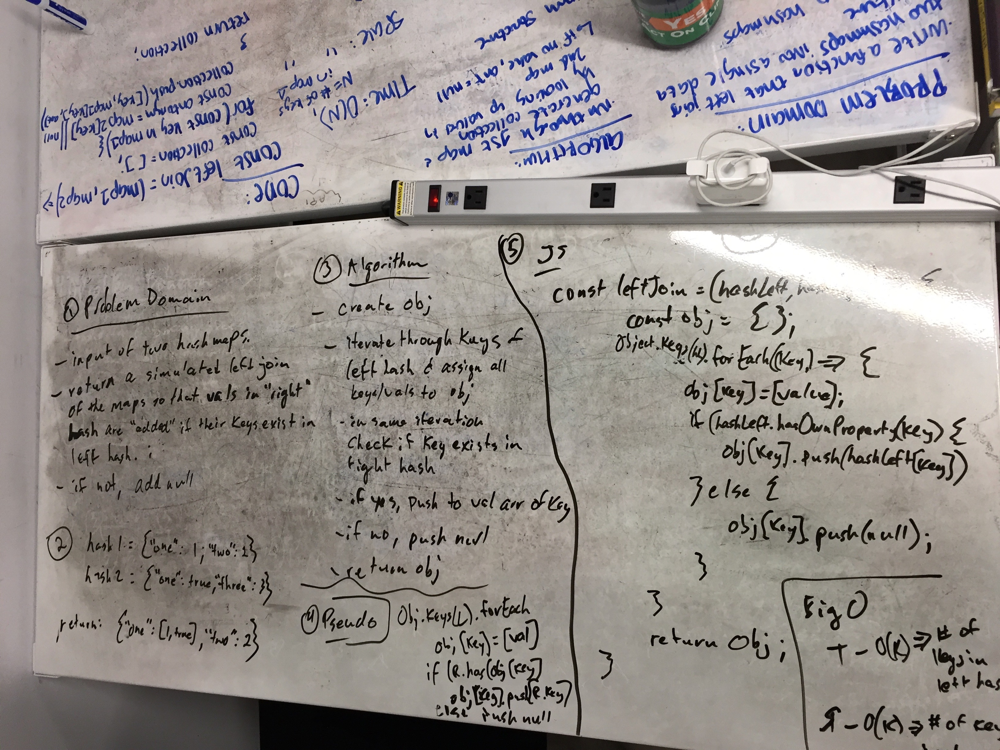

# Left join of two hashes

## Challenge
Two hash maps are accepted as input and the output is an object that simulates a SQL left-join of two tables. All keys and values from the left hash are included; if there are common keys in the right hash, the values in that hash are pushed in to the value array of the appropriate key from the left table. If not, null is pushed into the array.

## Solution
