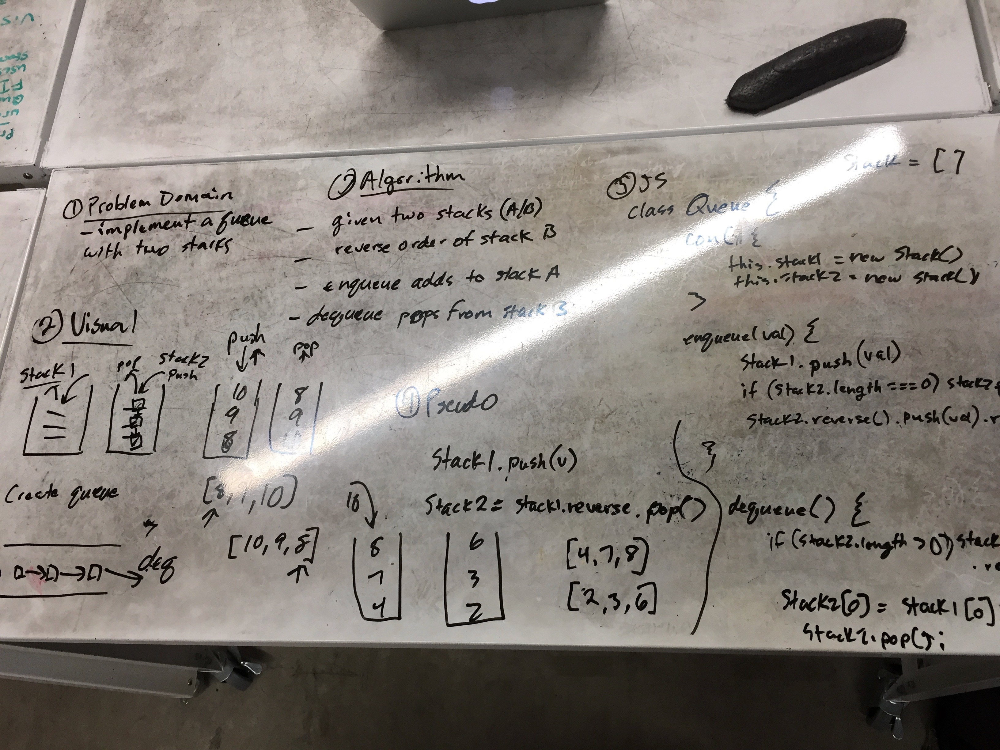

# Queue

## Challenge
Create a Queue from two different stacks. Stack A will act as the "entrance" to the queue, where Stack B will be the "exit", with values moving down stack A and up stack B before exiting (Last in, Last out).

## Solution

