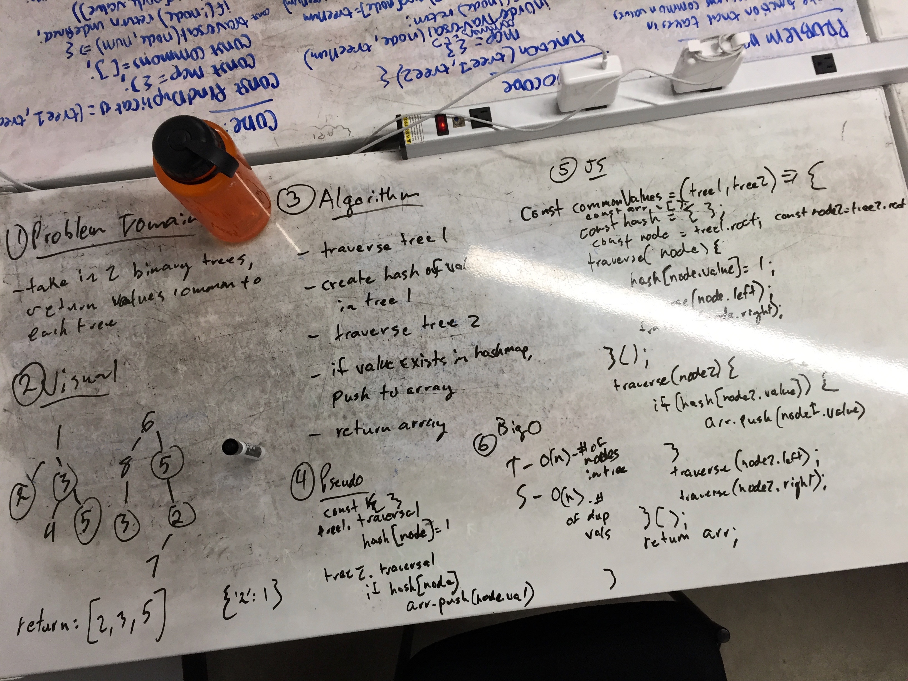

# Comparing two Binary trees

## Problem
This problem takes in an input of two binary trees and must return a set of values that are common to both trees. If no common values, an empty array is returned

## Solution
